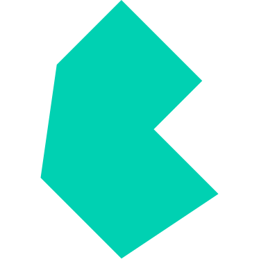

# Hi 👋 My name is Muhammed

## I'm a Front End Developer

I describe myself as a passionate developer who loves coding, open source, and the web platform ❤️

- 🌍  I'm based in Ukraine / Azerbaijan
- 🖥️  See my portfolio at [www.aliev.tech](http://aliev.tech)
- ✉️  You can contact me at [aliyev.developer@gmail.com](mailto:aliyev.developer@gmail.com)
- 🤝  I'm open to collaborating on project work or partnerships

### Skills

<!--  -->

  

### Socials

 
   

